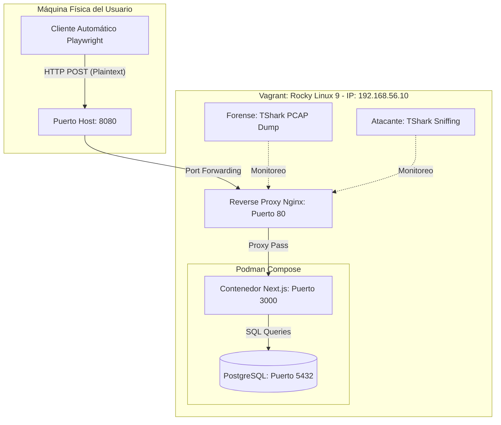
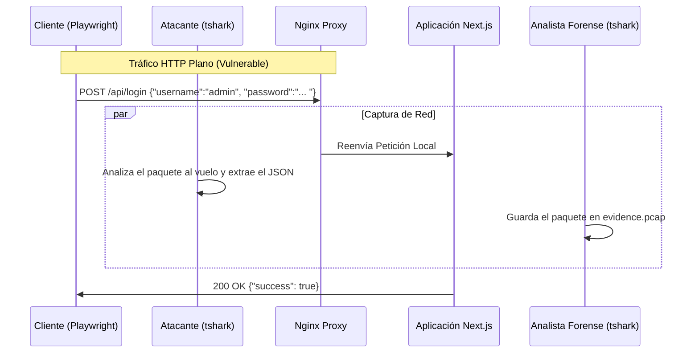

# Arquitectura del Laboratorio Forense

## 1. Topología de Red e Infraestructura

El entorno simula una red corporativa interna donde se aloja una aplicación de acceso (login) vulnerable por falta de cifrado.

## 2. Flujo de Vulnerabilidad y Captura (Sequence Diagram)

Este diagrama explica cómo viaja la credencial y en qué momento es robada/capturada por los actores.

## 3. Justificación de los Componentes

- **Rocky Linux 9**: Emula un entorno de servidor empresarial realista moderno, sucesor de CentOS.
- **Nginx sin SSL**: Punto crítico de la vulnerabilidad. Las credenciales viajan en texto plano, lo que permite el éxito del sniffing.
- **TShark (Wireshark CLI)**: Herramienta de captura fundamental tanto para atacantes (espionaje pasivo) como para peritos (preservación de evidencia de red).
- **Playwright**: Permite generar tráfico legítimo realista sin intervención manual constante.
