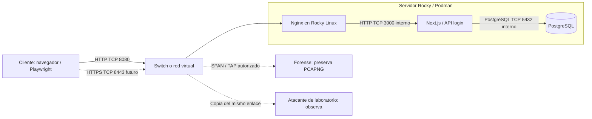

# Arquitectura y alcance

El dibujo del laboratorio representa un servidor, un switch, un cliente, un forense y un atacante. Se mantiene ese reparto, con un único servidor Rocky Linux que ejecuta los tres servicios de Compose.

## Participantes

| Persona | Rol | Trabajo |
|---|---|---|
| 1 | Administrador del servidor | Despliega Rocky, configura Nginx y define interfaz/IP de captura. |
| 2 | Cliente | Accede al portal y envía únicamente credenciales ficticias. Anota URL y hora UTC. |
| 3 | Forense | Captura antes del login, preserva original, calcula SHA-256 y redacta informe. |
| 4 | Atacante simulado | Intenta recuperar el login del PCAP autorizado en ambos escenarios, sin claves TLS. |

## Dónde observar

**Un switch no copia normalmente el tráfico unicast a todos sus puertos.** Conectar al forense y al atacante al mismo switch no garantiza que vean cliente → servidor. Usar un puerto espejo (SPAN), TAP, o capturar en la interfaz de entrada del servidor/cliente y entregar una copia a ambos. El modo promiscuo solo acepta tramas que llegan a la interfaz; no obliga al switch a enviarlas.

La modalidad inicial más sencilla es una captura en la interfaz de entrada de Rocky con `forensic_capture.sh`; después se entrega la misma evidencia al analista y al observador. Esto representa su acceso autorizado a una copia del enlace, no una intrusión remota al servidor. Si se necesita observación en vivo desde máquinas separadas, primero preparar SPAN/TAP o una topología de tránsito explícita.

**No usar `-i any` para la comparación:** podría incluir HTTP interno Nginx → Next.js aunque el cliente usara HTTPS. Tampoco incluir los puertos internos 3000 y 5432 en la captura comparativa. Para ZeroTier se captura la interfaz virtual del endpoint; ver [guía de ZeroTier](06-zerotier.md).

## Límites del experimento

En HTTP son recuperables el usuario, contraseña, URI, cabeceras y respuesta **que realmente se transmitieron y se capturaron**. No significa obtener archivos del servidor, toda la base de datos u otras sesiones ajenas a la captura.

En HTTPS bien validado, un observador pasivo de ese enlace sin secretos TLS obtiene metadatos, pero no el JSON del login. Los endpoints sí conocen los datos; HTTPS no protege ante un servidor comprometido, una captura después de terminar TLS, malware en el cliente o una CA maliciosa instalada. No se implementan ARP spoofing, downgrade, certificados fraudulentos ni ataques contra terceros.

La base conserva las cuentas ficticias en texto plano del proyecto original. Esto es una simplificación separada del transporte: HTTP filtra el login incluso si la base usa hashes. Para una aplicación real, reemplazar ese almacenamiento por hashes de contraseña y añadir gestión de sesiones. TLS no corrige por sí mismo estos aspectos.
