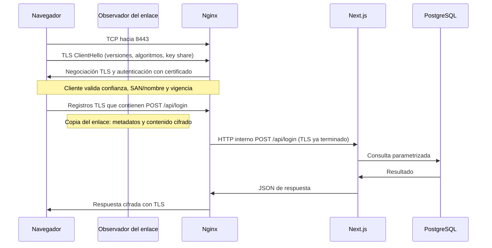

# Qué ocurre dentro de la conexión

## Capas y puertos

| Capa / protocolo | Papel en esta práctica | Lo que puede observarse |
|---|---|---|
| Ethernet / Wi-Fi | Transporta tramas por el enlace local. | MAC locales, tamaños; un switch limita dónde llegan las tramas. |
| ARP (IPv4) / NDP (IPv6) | Localiza al vecino o gateway en el enlace. | Resolución IP → MAC; no autentica la web. |
| DNS | Resuelve el nombre del servidor. | Solo se necesita si se usa nombre; `/etc/hosts` o la caché pueden evitar consultas. |
| IP | Dirige paquetes entre cliente y servidor. | Direcciones de origen/destino, longitudes. |
| TCP | Flujo fiable y ordenado, retransmisiones y puertos. | SYN, SYN-ACK, ACK; luego datos y cierre FIN/RST. |
| HTTP/1.1 | Petición/respuesta web sobre TCP. | Método, ruta, cabeceras y cuerpo legibles si no hay TLS. |
| TLS 1.2 / 1.3 | Protege el canal navegador → Nginx. | Negociación y registros cifrados; el login no es legible. |
| PostgreSQL | Protocolo de consultas entre backend y base de datos. | Solo red interna Podman, TCP 5432, fuera de la captura comparativa. |

Aquí no se habilitan HTTP/2 ni HTTP/3/QUIC. No confundir el puerto con el protocolo: 8080 sigue siendo HTTP; 8443 será HTTPS. Para puertos alternativos, Wireshark puede necesitar **Decode As → HTTP/TLS**.

## Recorrido HTTP

1. El cliente resuelve el nombre (si existe), escoge ruta y establece TCP contra el puerto 8080 de Rocky. ARP no se repite por cada petición si ya hay caché.
2. El navegador descarga HTML, JavaScript y CSS locales. No utiliza una CDN de Tailwind ni Google Fonts.
3. El usuario escribe la cuenta ficticia. `type="password"` solo oculta los caracteres en pantalla.
4. `fetch('/api/login')` serializa JSON y usa el mismo origen/protocolo de la página:

```http
POST /api/login HTTP/1.1
Host: 192.168.56.10:8080
Content-Type: application/json

{"username":"admin","password":"admin123"}
```

5. El socket publicado por Podman entrega la conexión a Nginx. Nginx crea otra conexión HTTP hacia `webapp:3000`; ambas conexiones no son el mismo flujo TCP.
6. La API valida tipos y consulta PostgreSQL con parámetros `$1` y `$2`. Una coincidencia devuelve 200; credenciales erróneas, 401; JSON inválido, 400; base no disponible, 503.
7. Nginx devuelve la respuesta al cliente. La captura permite reconstruir el cuerpo incluso cuando abarca varios segmentos, siempre que se tengan suficientes paquetes. POST **no cifra** y JSON **no cifra**.

## Recorrido HTTPS



El handshake negocia claves para proteger registros. La clave privada del certificado autentica al servidor; no «cifra toda la navegación» directamente. TLS moderno usa claves de tráfico simétricas y, con intercambio efímero, una clave privada robada después no basta por sí sola para descifrar una captura pasada. En TLS 1.3 gran parte del handshake, incluido el certificado, también va cifrada tras ServerHello.

El cliente debe validar el certificado. Si acepta cualquier certificado, ya no se está probando correctamente la autenticación del servidor. En esta configuración puede observarse SNI en ClientHello cuando se usa un nombre y no se negocia ECH; no asumir que SNI ni DNS están siempre presentes o visibles. IP, puertos, tamaño, tiempo y dirección de los paquetes siguen siendo observables.

## Tres protecciones distintas

- **Transporte TLS:** protege el tramo cliente → Nginx.
- **Almacenamiento de contraseñas:** un hash protege mejor una base robada; no evita que HTTP revele el password durante su envío. La base de esta demo conserva cuentas ficticias sin hash.
- **ZeroTier:** añade un túnel cifrado entre nodos; capturar en su interfaz física y en su interfaz virtual produce evidencia diferente.

No configurar `SSLKEYLOGFILE` ni importar claves en Wireshark durante la comparación pasiva. Un forense con secretos de sesión puede llegar a descifrar TLS: es un escenario distinto y debe declararse.

Referencias primarias: [semántica HTTP, RFC 9110](https://www.rfc-editor.org/rfc/rfc9110), [HTTP/1.1, RFC 9112](https://www.rfc-editor.org/rfc/rfc9112), [TLS 1.3, RFC 8446](https://www.rfc-editor.org/rfc/rfc8446), [TCP, RFC 9293](https://www.rfc-editor.org/rfc/rfc9293).
